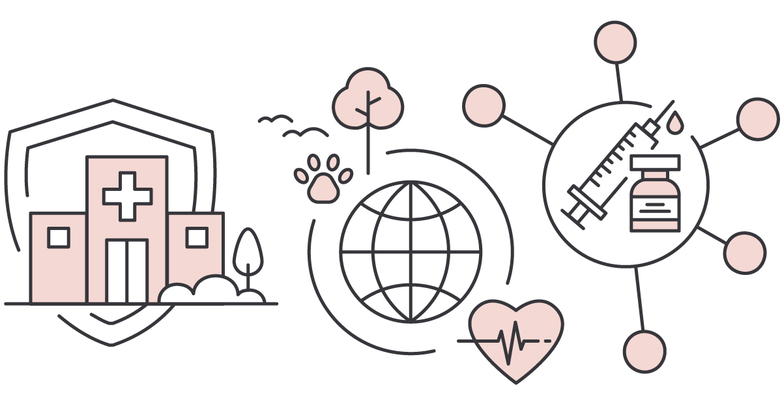

## Pendahuluan

... kesehatan, produktivitas, pembangunan ...

. . .

Era globalisasi dan kemajuan teknologi

## Konsep Dasar SIK {#konsep-dasar-sik}

. . .

[Sistem Informasi Kesehatan](#konsep-dasar),  adalah seperangkat tatanan yang meliputi data, informasi, indikator, prosedur, perangkat, teknologi, dan sumber daya manusia yang saling berkaitan dan dikelola secara terpadu untuk mengarahkan tindakan atau keputusan yang berguna dalam mendukung pembangunan kesehatan [@pp-ri-24-2014](#konsep-dasar).

. . . 

[Sistem Informasi Kesehatan Nasional](#konsep-dasar), Sistem Informasi Kesehatan yang dikelola oleh kementerian yang menyelenggarakan urusan pemerintahan di bidang kesehatan yang mengintegrasikan dan menstandarisasi seluruh Sistem Informasi Kesehatan dalam mendukung pembangunan Kesehatan [@uu-ri-17-2023](#konsep-dasar)

## Dasar Hukum

1. UU 11 Tahun 2008 tentang Informasi dan Transaksi Elektronik
1. UU 36 Tahun 2009 tentang Kesehatan
1. PP 82 Tahun 2012 tentang Penyelenggaraan Sistem dan Transaksi Elektronik
1. UU 72 Tahun 2012 tentang Sistem Kesehatan Nasional
1. PP 46 Tahun 2014 tentang Sistem Informasi Kesehatan
1. Permenkes 92 Tahun 2014 tentang Penyelenggaraan Komunikasi Data dalam Sistem Informasi Kesehatan Terintegrasi
1. UU 17 Tahun 2023 tentang Kesehatan

## Sistem Informasi Kesehatan yang Terintegrasi

Sistem Informasi Kesehatan yang terintegrasi adalah Sistem Informasi Kesehatan yang menyediakan menjalankan mekanisme saling hubung antar subsistem informasi dan lintas sistem informasi dengan berbagai cara yang sesuai dengan keperluannya, sehingga data dari suatu sistem secara rutin dapat melintas/mengalir, menuju atau diambil oleh satu atau lebih sistem yang lain. 

## Jaringan SIKNAS

Jaringan SIKNAS adalah sebuah koneksi/jaringan virtual sistem informasi kesehatan elektronik yang dikelola oleh Kementerian Kesehatan dan hanya bisa diakses bila telah dihubungkan. Jaringan SIKNAS merupakan infrastruktur jaringan komunikasi data terintegrasi dengan menggunakan Wide Area Network (WAN), jaringan telekomunikasi yang mencakup area yang luas serta digunakan untuk mengirim data jarak jauh antara Local Area Network (LAN) yang berbeda, dan arsitektur jaringan lokal komputer lainnya.

## Roadmap SIKN 2011-2014 {#visi-roadmap}

[Visi, ](#visi-roadmap)*Terwujudnya Sistem Informasi Kesehatan terintegrasi pada tahun 2014 yang mampu mendukung proses pembangunan kesehatan dalam menuju masyarakat sehat yang mandiri dan berkeadilan.*

## Roadmap SIKN 2011-2014 {#misi-roadmap}

[Misi](#misi-roadmap)

 

1. memperkuat pengelolaan SIK yang meliputi landasan hukum, kebijakan dan program, advokasi dan koordinasi.
2. menstandarisasi indikator kesehatan agar dapat menggambarkan derajat kesehatan masyarakat.
3. memperkuat sumber data dan membangun jejaringnya dengan semua pemangku kepentingan termasuk swasta dan masyarakat madani.
4. meningkatkan pengelolaan data kesehatan yang meliputi pengumpulan, penyimpanan, dan analisis data, serta diseminasi informasi.
5. memperkuat sumber daya Sistem Informasi Kesehatan yang meliputi pemanfaatkan teknologi informasi dan komunikasi, sumber daya manusia, pembiayaan, sarana dan prasarana.
6. Memperkuat kualitas data kesehatan dengan menerapkan jaminan kualitas dan sistem pengendaliannya.
7. meningkatkan budaya penggunaan data dan informasi untuk penyelenggaraan upaya kesehatan yang efektif dan efisien serta untuk mendukung tata kelola kepemerintahan yang baik dan bagi masyarakat luas

## Subsistem SIKNAS {#sub-siknas}

## Implementasi dan Tantangan

Langkah-langkah implementasi SIKNAS: pengembangan infrastruktur, pelatihan sumber daya manusia, dan promosi penggunaan.

Tantangan yang dihadapi: kurangnya infrastruktur teknologi, kurangnya sumber daya manusia terlatih, dan keamanan data.

## Studi Kasus (Opsional)

Contoh implementasi SIKNAS di negara tertentu: Indonesia, India, Ghana, dll.

Keberhasilan dan tantangan yang dihadapi dalam implementasi SIKNAS.

## Kesimpulan

Pentingnya SIKNAS dalam meningkatkan pelayanan kesehatan, pengambilan keputusan, dan pengelolaan data kesehatan secara efektif.

Harapan untuk masa depan: peningkatan infrastruktur, pembaruan teknologi, dan pengembangan sumber daya manusia.

## Referensi

